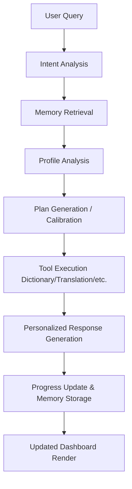

# LingoLift AI – Language Learning Agent

LingoLift AI is an AI-powered Language Learning Agent designed to help users improve English in a structured and personalized way. Unlike traditional static chatbots, LingoLift functions as a true AI assistant by integrating state memory, automated planning roadmaps, tool-assisted execution, and dynamic progress trackers.

---

## 🌟 Core Agent Capabilities

### 1. Memory
The agent maintains user profile details and state parameters across sessions:
- **User Goal**: (Placements, IELTS, Communication, etc.)
- **Learning Level**: (Beginner, Intermediate, Advanced)
- **Weak Areas**: (Grammar, Pronunciation, Vocabulary, Conversation)
- **Learning Progress**: Tracking current completed days.
- **Current Day**: Marks the active day in the learning roadmap (e.g., Day 7 / 30).

*Example State:*
```yaml
Goal: Placements
Level: Beginner
Weak Areas: [Grammar, Pronunciation]
Current Progress: Day 7 / 30 (23.3%)
```

### 2. Planning
The agent automatically plans and adjusts the curriculum:
- **Roadmap Generation**: Creates a personalized 30-Day Learning Roadmap.
- **Week-wise Strategy**: Focuses on specific skills per week.
- **Day-wise Curriculum**: Defines daily objectives, study guidelines, specific tasks, assessments, and expected outcomes.

*Example Plan:*
- **Week 1**: Grammar Foundation
  - **Day 1**: Sentence Structure SVO Basics
  - **Day 2**: Simple Present Tense
  - **Day 3**: Past Simple Tense

### 3. Tool Usage
The agent is backed by specialized external APIs and modules to resolve linguistic queries:
- **Dictionary API**: Explains definitions, parts of speech, and usage tips.
- **Translation API**: Translates English queries (e.g. to Telugu: శుభోదయం).
- **Pronunciation Support**: Syllabification and sound helper tips.
- **Vocabulary & Thesaurus**: Synonym and antonym search lookups.

### 4. Progress Tracking
The agent tracks metrics to measure course compliance:
- **Completed Days Count** (e.g. 10 Days Completed)
- **Learning Progress Percentage** (e.g. 35%)
- **Vocabulary Words Learned** (e.g. 120 words)
- **Grammar Exercises Solved** (e.g. 45 exercises)
- **Learning Day Streak** (e.g. 6 Days)

---

## 🔄 AI Agent Workflow



---

## 🛠️ Tech Stack

### Frontend
- **Framework**: React.js (Vite template)
- **Styling**: Vanilla CSS (HIG Apple-inspired layout with responsive dashboard grid)
- **Icons**: Lucide React
- **Animations**: Framer Motion

### Backend
- **Framework**: FastAPI (Python 3.10+)
- **Runner**: Uvicorn ASGI server

### AI Layer & Tools
- **Orchestration**: LLM Prompt Engineering & Intent Classification
- **Memory Management**: Local persistent JSON database tracking learner metrics
- **External Tools**: Dictionary API and Translation API router interfaces

---

## 🤖 What Makes It an AI Agent?

Unlike a traditional question-and-answer chatbot, LingoLift possesses capabilities that define an autonomous learning agent:

| Capability Feature | Traditional Chatbot | LingoLift AI Agent |
| :--- | :---: | :---: |
| **Maintains User Memory** | ❌ No | ✅ Yes |
| **Creates Personalized Learning Plans** | ❌ No | ✅ Yes |
| **Tracks Long-Term Progress** | ❌ No | ✅ Yes |
| **Executes External Tools** (APIs) | ❌ No | ✅ Yes |
| **Generates Day-wise Curriculum Activities** | ❌ No | ✅ Yes |
| **Adapts Recommendations Based on Profile** | ❌ No | ✅ Yes |

This enables LingoLift to function as a personalized **AI Learning Partner** rather than a simple search interface.

---

## 🚀 Local Installation & Setup

### 1. Backend Setup
1. Navigate to the backend directory:
   ```bash
   cd backend
   ```
2. Create and activate a Python virtual environment:
   ```bash
   python -m venv venv
   # On Windows:
   .\venv\Scripts\activate
   ```
3. Install dependencies:
   ```bash
   pip install -r requirements.txt
   ```
4. Create a `.env` file inside `backend/` and configure your API key:
   ```env
   GROQ_API_KEY=your_groq_api_token_here
   ```
5. Start the FastAPI server:
   ```bash
   uvicorn main:app --reload
   ```
   *The backend will boot up at `http://127.0.0.1:8000`.*

### 2. Frontend Setup
1. Navigate to the frontend directory:
   ```bash
   cd ../frontend
   ```
2. Install npm dependencies:
   ```bash
   npm install
   ```
3. Create a `.env` file inside `frontend/` and configure the backend URL:
   ```env
   VITE_API_URL=http://127.0.0.1:8000
   ```
4. Start the Vite dev server:
   ```bash
   npm run dev
   ```
   *The frontend application will boot up at `http://localhost:5173`.*
